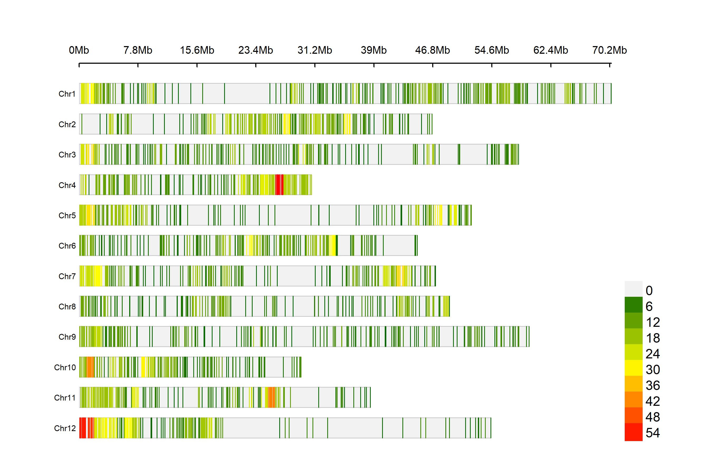
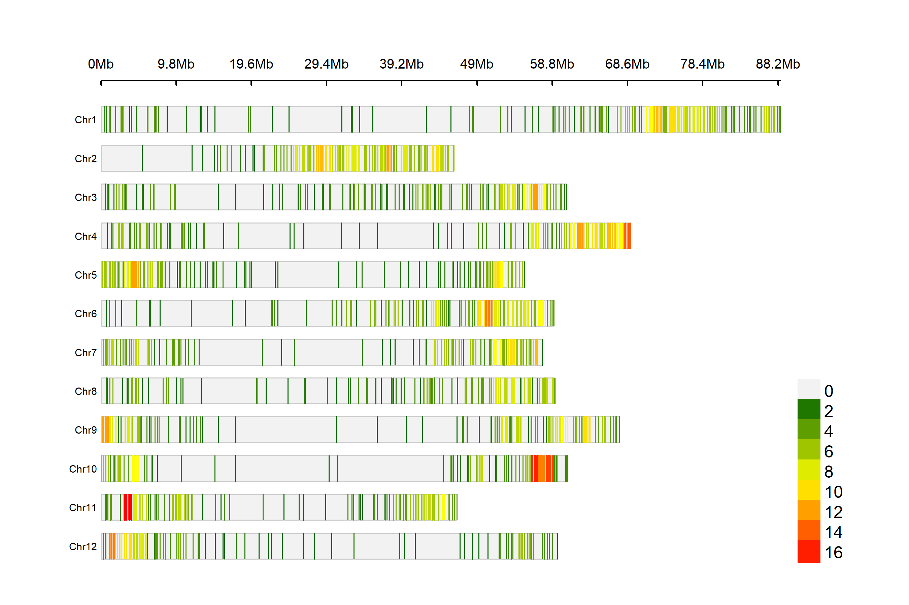

```{r, echo=FALSE, message=FALSE}
library(tidyverse)
library(readxl)
library(readr)
library(dplyr)
library(stringr)
library(parallel)
library(tibble)
library(future)
library(updog)
library(CMplot)
```

# Information

Genotyping of the study population was performed in two orders:

* Report-DP24-8964 (no file MADC)

* Report-DP24-8965 (file MADC)

# SNP Mismatch Visualization with Reference and Nucleotide Labels

```{r}
# ----------------------------
# 1. Define reference sequence
# ----------------------------
ref <- 
  "CCGCTCCCGGACGGTGGCTATTAATTTTGAAATAATAATATGTAGTATGATATATATTATAGCCGTGGCAAACAACTCACT"

# ----------------------------
#2. Split reference into bases
# ----------------------------
ref_bases <- strsplit(ref, "")[[1]]

# ----------------------------
# 3. Create data frame for reference row
# ----------------------------
ref_df <- tibble(
  SeqName  = "Reference",
  Position = seq_along(ref_bases),
  RefBase  = ref_bases,
  Base     = ref_bases,
  Match    = NA
)

# ----------------------------
# 4. Define sequences to compare
# ----------------------------
seqs <- c(
  "CCGCTCCCGGACGGTGGCTATTAATTTTGAAATAATAATATGTACTATGATATATATTATAGCCGTGGCAAACAACTCACT",  # Alt
  "CCGCTCCCGGACGGTGGCTATTAATTTTGAAATAATAATATGTAGTATGATATATATTATAGCCAGCAAACAACTCACTAA",  # RefMatch
  "CCGCTCCCGGACGGTGGCTATTAATTTTGAAATAATAATATGTAGTATGATATATATTATAGCCGCAGCAAACAACTCACT",  # RefMatch
  "CCGCTCCCGGACGGTGGCTATTAATTTTGAAATAATAATATGTAGTATGATATATATTATAGCCGCGGCAAATAACTCACT",  # RefMatch
  "CCGCTCCCGGACGGTGGCTATTAATTTTGAAATAATAATATGTACTATGATATATATTAAAGCCGCGGCAAACAACTCACT",  # AltMatch
  "CCGCTCCCGGACGGTGGCTATTAATTTTGAAATAATAATATGTACTATGATGTATATTATTGCCGCGGCAAACAACTCACT"   # AltMatch
)
names(seqs) <- c("Alt", paste0("Seq_", seq_along(seqs)[-1]))

# ----------------------------
# 5. SNP‐building function
# ----------------------------
get_snp_df <- function(sequence, ref, seqname) {
  ref_split <- strsplit(ref, "")[[1]]
  seq_split <- strsplit(sequence, "")[[1]]
  len <- min(length(ref_split), length(seq_split))
  tibble(
    SeqName  = seqname,
    Position = 1:len,
    RefBase  = ref_split[1:len],
    Base     = seq_split[1:len],
    Match    = (Base == RefBase)
  )
}

# ----------------------------
# 6. Assemble full data frame
# ----------------------------
wanted <- names(seqs)
seq_df <- map2_dfr(seqs[wanted], wanted, ~ get_snp_df(.x, ref, .y))
all_df  <- bind_rows(ref_df, seq_df) %>%
  mutate(SeqName = factor(SeqName, levels = c("Reference", wanted)))
```


```{r}
#| fig-width: 12
#| fig-height: 5
ggplot(all_df, aes(x = Position, y = SeqName, label = Base)) +
  geom_tile(aes(fill = Match, alpha = is.na(Match)), data = all_df) +
  scale_alpha_manual(values = c(`TRUE` = 1, `FALSE` = 1), guide = "none") +
  scale_fill_manual(
    na.value  = "lightblue",   # reference row
    values    = c("FALSE" = "firebrick", "TRUE" = "gray90"),
    labels    = c("Mismatch", "Match")
    ) +
  geom_text(size = 3, color = "black") +
  scale_y_discrete(limits = rev(levels(all_df$SeqName))) +
  labs(
    title = "Per-base SNP Plot with Reference on Top",
    x     = "Reference Position",
    y     = "Sequence",
    fill  = "Base Match"
  ) +
  theme_minimal(base_size = 13) +
  theme(
    panel.grid   = element_blank(),
    legend.position = "bottom"
  )
```

# Build and Filter Crosswalk Table

```{r, eval=FALSE}

# -----------------------
# 2. Load Input Datasets
# -----------------------

datagrid <- read_excel("plates/DataGrid-24-PEP-02.xlsx")
ped      <- get(load("pedigree/pedigree.rda"))
cip      <- readRDS("phenotype/template_oxa22.rds")
dart     <- read_excel("plates/names_in_dart.xlsx")

# -----------------------
# 3. Construct Base Crosswalk Table
# -----------------------

crosswalk <- datagrid %>%
  transmute(
    Sample_ID       = `Sample ID`,
    Customer_Name   = `Customer Sample Name (optional)`,
    Subject_Barcode = `Subject Barcode (optional)`
  )

# -----------------------
# 4. Merge Pedigree Data by Subject Barcode
# -----------------------

crosswalk <- crosswalk %>%
  left_join(ped, by = c("Subject_Barcode" = "geno"))

# -----------------------
# 5. Clean and Annotate Crosswalk Table
# -----------------------

crosswalk <- crosswalk %>%
  mutate(
    CIP        = Subject_Barcode %in% cip$geno,
    DArT       = Sample_ID %in% dart$MarkerID,
    full_sib      = ifelse(!is.na(female) & !is.na(male),
                           paste0(female, "_x_", male),
                           NA_character_)
  )

# -----------------------
# 6. Finalize and Export Full Crosswalk
# -----------------------

crosswalk <- crosswalk %>%
  select(
    Sample_ID, Customer_Name, Subject_Barcode,
    female, male, full_sib,
    CIP, DArT
  )

# Preview and save
print(head(crosswalk, 10))
write.csv(
  crosswalk,
  file = "rdata_and_spreadsheets/crosswalk_table_sorted.csv",
  row.names = FALSE
)

# -----------------------
# 7. Filter for Samples Present in DArT and Keep Exclusively MDP Plates 
# -----------------------

# 1. Pull out all non‑zero, non‑NA parents in one go
parents <- crosswalk %>% 
  select(female, male) %>% 
  pivot_longer(everything(), values_drop_na = TRUE, names_to = NULL) %>% 
  distinct(value) %>% 
  pull(value) %>% 
  setdiff(0)

# 2. Filter for in_DArT and keep either parents or full_sib families
crosswalk_filtered <- crosswalk %>%
  filter(DArT,
         Subject_Barcode %in% parents | !is.na(full_sib)) |> 
  filter(str_starts(Subject_Barcode, "CIP3181"))
  
# Preview and save filtered table
cat("Filtered crosswalk dimensions:", dim(crosswalk_filtered), "\n")
write.csv(
  crosswalk_filtered,
  file = "rdata_and_spreadsheets/crosswalk_table_sorted_only.csv",
  row.names = FALSE
)
```

# Distribution 

```{r}
crosswalk <- read.csv(file = "rdata_and_spreadsheets/crosswalk_table_sorted_only.csv")
dt <- data.table::as.data.table(crosswalk)
dt 
```

## Create family counts
```{r}
# ─── 1. Create family counts from filtered crosswalk ──────────────────────────
family_counts <- crosswalk %>%
  filter(!is.na(female), !is.na(male), female != 0, male != 0) %>%
  group_by(female, male) %>%
  summarise(n.ind = n(), .groups = "drop") %>%
  {
    main <- .
    
    fem_totals <- main %>%
      group_by(female) %>%
      summarise(n.ind = sum(n.ind), .groups = "drop") %>%
      mutate(male = "Total_Half_Sib_2") %>%
      select(female, male, n.ind)
    
    male_totals <- main %>%
      group_by(male) %>%
      summarise(n.ind = sum(n.ind), .groups = "drop") %>%
      mutate(female = "Total_Half_Sib_1") %>%
      select(female, male, n.ind)
    
    grand_total <- tibble(
      female = "Total_Half_Sib_1",
      male = "Total_Half_Sib_2",
      n.ind = sum(main$n.ind, na.rm = TRUE)
    )
    
    bind_rows(main, fem_totals, male_totals, grand_total)
  }

# ─── 2. Define axis orders ────────────────────────────────────────────────────
female_order <- c(
  sort(unique(family_counts$female[family_counts$female != "Total_Half_Sib_1"])),
  "Total_Half_Sib_1"
)

male_order <- c(
  "Total_Half_Sib_2",
  sort(unique(family_counts$male[family_counts$male != "Total_Half_Sib_2"]))
)

# ─── 3. Re-factor and label ───────────────────────────────────────────────────
family_counts <- family_counts %>%
  mutate(
    female = factor(female, levels = female_order),
    male = factor(male, levels = male_order),
    female_lab = fct_relabel(female, ~ str_to_title(str_replace_all(., "_", " "))),
    male_lab = fct_relabel(male, ~ str_to_title(str_replace_all(., "_", " "))),
    is_total = female == "Total_Half_Sib_1" | male == "Total_Half_Sib_2",
    is_grand_total = female == "Total_Half_Sib_1" & male == "Total_Half_Sib_2"
  )

# ─── 4. Label-only data for totals and grand total ────────────────────────────
label_data <- family_counts %>%
  filter(is_total) %>%
  transmute(
    female_lab,
    male_lab,
    label = n.ind
  )

# ─── 5. Main plot data (excluding totals) ─────────────────────────────────────
plot_data <- family_counts %>%
  filter(!is_total)
```


```{r}
#| fig-width: 8
#| fig-height: 5
#| fig-dpi: 400

ggplot(plot_data, aes(x = male_lab, y = female_lab)) +
  geom_point(aes(size = n.ind, fill = n.ind), shape = 21, colour = "black") +
  geom_text(aes(label = n.ind), colour = "white", size = 3) +
  geom_label(
    data = label_data,
    aes(x = male_lab, y = female_lab, label = label),
    fill = "grey90", fontface = "bold", size = 3.5, label.size = 0.3
  ) +
  scale_fill_gradient(
    name = "n.ind",
    low = "lightblue",
    high = "darkblue",
    na.value = "grey80"
  ) +
  scale_size_area(max_size = 15, guide = "none") +
  scale_x_discrete(position = "top") +
  theme_minimal(base_size = 12) +
  theme(
    axis.text.x = element_text(angle = 45, hjust = 0),
    axis.text.y = element_text(vjust = 1)
  ) +
  labs(x = NULL, y = NULL)
```

# Alignment

The [Atlantic](https://spuddb.uga.edu/ATL_v3_download.shtml) reference genome was used for alignment, as recommended by Prof. Gui.

```{r, eval=FALSE}
# =============================================================================
# 1. Set paths and parameters
# =============================================================================

# Reference genome FASTA
genome_fa <- normalizePath("genome_blast/ATL_v3.asm.fa")

db_name <- "genome_blast/ATL_v3.asm"

# Depth threshold: minimum mean read depth per SNP to keep it
depth.th <- 20

```

```{r, eval=FALSE}
# =============================================================================
# 2. Create BLAST DB (one‑time step)
# =============================================================================

if (!file.exists(paste0(db_name, ".nin"))) {
  message("Creating BLAST DB: ", db_name)
  system2("makeblastdb",
          args = c("-in", genome_fa,
                   "-dbtype", "nucl",
                   "-out",  db_name))
} else {
  message("BLAST DB already exists: ", db_name)
}


# =============================================================================
# 3. Define BLAST wrapper function
# =============================================================================

blast_my_potato <- function(query_seq) {
  # Write query to FASTA
  query_fa <- tempfile(pattern = "qry_", fileext = ".fa")
  writeLines(c(">my_query", query_seq), query_fa)
  # Format: tabular with selected fields
  outfmt_string <- "6 qseqid sseqid pident length qstart qend sstart send evalue bitscore"
  # Run blastn
  out_tbl <- tempfile(pattern = "blast_", fileext = ".tsv")
  a1 <-  c(
    "-query", query_fa,
    "-db", db_name,
    "-out", out_tbl,
    "-outfmt", shQuote(outfmt_string),     # Ensure proper quoting of format
    "-max_target_seqs", "10",
    "-evalue", "1e-5"
  ) 
  a2 <-  c(
    "-task", "blastn-short",
    "-dust", "no",
    "-word_size", "7",
    "-query", query_fa,
    "-db", db_name,
    "-out", out_tbl,
    "-outfmt", shQuote(outfmt_string),     # Ensure proper quoting of format
    "-max_target_seqs", "10",
    "-evalue", "1e-5"
  ) 
  
  system2("blastn",
          args = a1,
          stdout = FALSE, 
          stderr = FALSE 
  )
  
  # Read results
  results <- read.table(out_tbl, header = FALSE, sep = "\t",
                        stringsAsFactors = FALSE,
                        col.names = c(
                          "query_id","subject_id",
                          "perc_identity","align_length",
                          "q_start","q_end",
                          "s_start","s_end",
                          "evalue","bit_score"
                        ))
  if(nrow(results) > 0)
    return(results)
  else{
    system2("blastn",
            args = a2,
            stdout = FALSE, 
            stderr = FALSE 
    )
    
    # Read results
    results <- read.table(out_tbl, header = FALSE, sep = "\t",
                          stringsAsFactors = FALSE,
                          col.names = c(
                            "query_id","subject_id",
                            "perc_identity","align_length",
                            "q_start","q_end",
                            "s_start","s_end",
                            "evalue","bit_score"
                          ))
    return(results)
  }
}


# =============================================================================
# 4. Load and prepare input data
# =============================================================================

# Allele‐count data
MADC <- readRDS("rdata_and_spreadsheets/allele_count_file.rds")

# Split by CloneID to get a list of data.frames, one per haplotype
MADC_split_by_microhap <- split(MADC, MADC$CloneID)

# =============================================================================
# 5. Define per‑haplotype processing function
# =============================================================================

process_haplotype <- function(j) {
  x <- MADC_split_by_microhap[[j]]
  # Identify the index of the “reference” allele in this haplotype
  id.ref <- grep("\\|Ref$", x$AlleleID)
  if (length(id.ref) != 1) {
    return(list(ref = NULL, alt = NULL))
  }
  ref.seq <- x$ClusterConsensusSequence[id.ref]
  
  # 1) BLAST the reference sequence
  y <- blast_my_potato(ref.seq)
  
  # If BLAST returned no hits, skip this haplotype
  if (is.null(y) || nrow(y) == 0) {
    return(list(ref = NULL, alt = NULL))
  }
  
  y <- y[which.max(y$perc_identity), , drop = FALSE]
  
  # Safety check in case BLAST returns malformed result
  if (nrow(y) == 0 || is.na(y$s_start) || is.na(y$s_end)) {
    return(list(ref = NULL, alt = NULL))
  }
  
  if(y$s_start > y$s_end){
    temp <- y$s_start
    y$s_start <- y$s_end
    y$s_end <-temp
  }

  # 2) Identify biallelic SNP positions
  sequences <- str_split_fixed(x$AlleleSequence, "", nchar(x$AlleleSequence[1]))
  R_seq    <- str_split(ref.seq, "")[[1]]
  snp.pos  <- which(apply(sequences, 2, function(col) length(unique(col)) == 2))
  if (length(snp.pos) == 0) {
    return(list(ref = NULL, alt = NULL))
  }
  M <- sequences[, snp.pos, drop = FALSE]
  R <- R_seq[snp.pos]
  
  # 3) Extract read-depth matrix (cols 17 onward)
  Z <- x[ , -(1:16), drop = FALSE]
  
  # 4) Split sample indices by allele at each SNP
  W <- apply(M, 2, function(col) split(seq_along(col), col))
  if (!length(W)) {
    return(list(ref = NULL, alt = NULL))
  }
  
  Y.ref <- Y.alt <- NULL
  
  # 5) For each SNP, sum depths for ref & alt groups
  for (i in seq_along(W)) {
    idr <- which(names(W[[i]]) == R[i])
    ida <- which(names(W[[i]]) != R[i])
    if (length(idr) == 1 && length(ida) == 1) {
      ref.allele <- names(W[[i]])[idr]
      alt.allele <- names(W[[i]])[ida]
      pos        <- sprintf("%09d", y$s_start + snp.pos[i] - 1)
      ch         <- y$subject_id
      
      sums_ref <- apply(Z[W[[i]][[idr]], ], 2, sum)
      sums_alt <- apply(Z[W[[i]][[ida]], ], 2, sum)
      
      tpl <- function(sums) {
        tibble(
          snp.id = paste0(ch, "_", pos, "_[", ref.allele, ":", alt.allele, "]_hap_", j),
          !!!as.list(sums)
        )
      }
      
      Y.ref <- rbind(Y.ref, tpl(sums_ref))
      Y.alt <- rbind(Y.alt, tpl(sums_alt))
    }
  }
  
  # 6) Filter by depth threshold
  if (nrow(Y.ref) > 0 && nrow(Y.alt) > 0) {
    keep <- apply(Y.ref[,-1], 1, mean) > depth.th &
      apply(Y.alt[,-1], 1, mean) > depth.th
    Y.ref <- Y.ref[keep, , drop = FALSE]
    Y.alt <- Y.alt[keep, , drop = FALSE]
  }
  
  list(ref = Y.ref, alt = Y.alt)
}

# =============================================================================
# 6. Run in parallel and aggregate results
# =============================================================================

message("Processing ", length(MADC_split_by_microhap), " haplotypes on ", ncore, " cores...")

system.time({
  res_list <- mclapply(
    X        = seq_along(MADC_split_by_microhap),
    FUN      = process_haplotype,
    mc.cores = 1
  )
})

# Combine all per-haplotype data.frames into two global tables
V.ref <- do.call(rbind, lapply(res_list, `[[`, "ref"))
V.alt <- do.call(rbind, lapply(res_list, `[[`, "alt"))

message("Done! 'V.ref' and 'V.alt' are ready with filtered SNP-depth summaries.")

# =============================================================================
# Save results
# =============================================================================
saveRDS(V.ref, "rdata_and_spreadsheets/V_ref.rds")
saveRDS(V.alt, "rdata_and_spreadsheets/V_alt.rds")
# =============================================================================
```

# Dosage

```{r}
# -----------------------
# 2. Import data
# -----------------------
crosswalk <- read_csv(
  "rdata_and_spreadsheets/crosswalk_table_sorted_only.csv",
  col_types = cols(Sample_ID = col_character())
)

# Read in allele‐count matrices for reference and alternate alleles
V_ref <- readRDS("rdata_and_spreadsheets/V_ref.rds")
V_alt <- readRDS("rdata_and_spreadsheets/V_alt.rds")

# -----------------------
# 3. Filter to SNPs on chromosomes
# -----------------------
# Identify rows where snp.id contains "Chr"
idx_ref <- grepl("chr", V_ref$snp.id)
idx_alt <- grepl("chr", V_alt$snp.id)

# Check that filtering indices match
stopifnot(all(idx_ref == idx_alt))

# Subset to only chromosome SNPs
V_ref <- V_ref[idx_ref, ]
V_alt <- V_alt[idx_alt, ]

# Convert SNP IDs to row names for matrix operations
V_ref <- V_ref %>% column_to_rownames("snp.id")
V_alt <- V_alt %>% column_to_rownames("snp.id")

# Verify that dimensions align
stopifnot(
  all(colnames(V_ref) == colnames(V_alt)),
  all(rownames(V_ref) == rownames(V_alt))
)

# -----------------------
# 4. Subset
# -----------------------

fix_names <- function(x) {
  x <- sub("^X", "", x)       # elimina X al inicio
  x <- gsub("\\.", "-", x)    # reemplaza todos los puntos por guiones
  return(x)
}

colnames(V_ref) <- fix_names(colnames(V_ref))
colnames(V_alt) <- fix_names(colnames(V_alt))

# Reorder and subset columns by Sample_ID in crosswalk
samples <- crosswalk$Sample_ID
V_ref_MDP <- V_ref[, samples]
V_alt_MDP <- V_alt[, samples]

# Compute total read counts per SNP (ref + alt)
V_tot_MDP <- V_ref_MDP + V_alt_MDP
```

## Coverage
```{r}
# Mean total count per SNP
q <- apply(V_tot_MDP, 1, mean)
hist(q, breaks = 300)
```

```{r}
# Filtering alleles with a mean depth ranging from 10 to 1000:
id <- q > 10 & q < 1000
length(id)
q <- q[id]
```

```{r}
hist(q,
     breaks = 300,
     main   = "SNP Coverage Distribution (Mean Total Reads)",
     xlab   = "Mean Total Read Count per SNP")
abline(v = median(q), col = "red", lwd = 2)
abline(v = mean(q),  col = "blue", lwd = 2)
```

## Prepare matrices for updog
```{r, eval=FALSE}
sizemat <- as.matrix(V_tot_MDP[id, ]); dim(sizemat)
refmat <- as.matrix(V_ref_MDP[id, ]); dim(refmat)
altmat <- as.matrix(V_alt_MDP[id, ]); dim(altmat)
save(sizemat, refmat, file = "rdata_and_spreadsheets/refsizemat.rda")
rm(list = ls())
```

## Run multidog model
```{r,eval=FALSE}
mout <- multidog(
  refmat  = refmat,
  sizemat = sizemat,
  ploidy  = 4,
  model   = "norm",
  nc      = ncore
)
```

```{r, include=FALSE}
mout <- readRDS("~/Mwanga_Panel/rdata_and_spreadsheets/dosage_calling.rds")
```

```{r}
# -----------------------
# 8. Visualize results
# -----------------------
plot(mout, indices = 55:60)
```

```{r, eval=FALSE}
saveRDS(mout, file = "rdata_and_spreadsheets/dosage_calling.rds")
```

```{r}
genomat <- format_multidog(mout, varname = "geno")
genomat[1:5, 1:5]
saveRDS(genomat, file = "rdata_and_spreadsheets/dosage.rds")
```

## Filtering functions
```{r}
count.na <- function(x) {table(is.na(x))["TRUE"]}
count.A <- function(x, ploidy = 4) {sum(table(x)*as.numeric(names(table(x)))) / (sum(table(x))*ploidy)}
count.class <- function(x) {length(table(x))}
marker.callrate <- function(genomat, max.mis = 0.2) {
  z <- apply(genomat, 2, count.na)
  z[is.na(z)] <- 0
  z <- z / nrow(genomat)
  return(which(z >= max.mis))
}
ind.callrate <- function(genomat, max.mis = 0.2) {
  z <- apply(genomat, 1, count.na)
  z[is.na(z)] <- 0
  z <- z / ncol(genomat)
  return(which(z >= max.mis))
}
allele.freq <- function(genomat, min.maf = 0.05) {
  z <- apply(genomat, 2, count.A)
  return(which(z > 1-min.maf | z < min.maf))
}
monomorphic <- function(genomat) {
  z <- apply(genomat, 2, count.class)
  return(which(z == 1))
}
```

```{r}
mcr <- marker.callrate(genomat)
if(length(mcr) > 0) {
  print(length(mcr))
  genomat <- genomat[,-mcr]
  print(dim(genomat))
}
icr <- ind.callrate(genomat)
if(length(icr) > 0) {
  print(length(icr))
  genomat <- genomat[-icr,]
  print(dim(genomat))
}
maf <- allele.freq(genomat)
if(length(maf) > 0) {
  print(length(maf))
  genomat <- genomat[,-maf]
  print(dim(genomat))
}
mon <- monomorphic(genomat)
if(length(mon) > 0) {
  print(length(mon))
  genomat <- genomat[,-mon]
  print(dim(genomat))
}
table(is.na(genomat))
genomat[1:5, 1:5]
```

```{r}
saveRDS(genomat, file = "rdata_and_spreadsheets/dosage_filt.rds")
rm(list = ls())
```

# Distribution of markers

```{r, message=FALSE}
genomat <- readRDS("rdata_and_spreadsheets/dosage_filt.rds")

crosswalk <- read_csv("rdata_and_spreadsheets/crosswalk_table_sorted_only.csv")
```

```{r}
snp.id <- rownames(genomat)
chp <- str_split_fixed(snp.id, "chr|_", 5)[,2:5]
chp[,3] <- sub("^0+", "", chp[,3])
u <- data.frame(SNP = rownames(genomat), 
                Chromosome = as.numeric(chp[,1]), 
                Position = as.numeric(chp[,3]))
```


```{r, eval=FALSE}
CMplot(u, type = "p", plot.type = "d", bin.size = 1e6, chr.den.col = c("darkgreen", "yellow", "red"), file = "png", dpi = 300, main = "", file.output = TRUE, verbose = TRUE, width = 9, height = 6, file.name = "dartag")
```

**Now**

* 4460 markers




**Using only the markers in the DarTag file**

* 1897 markers




